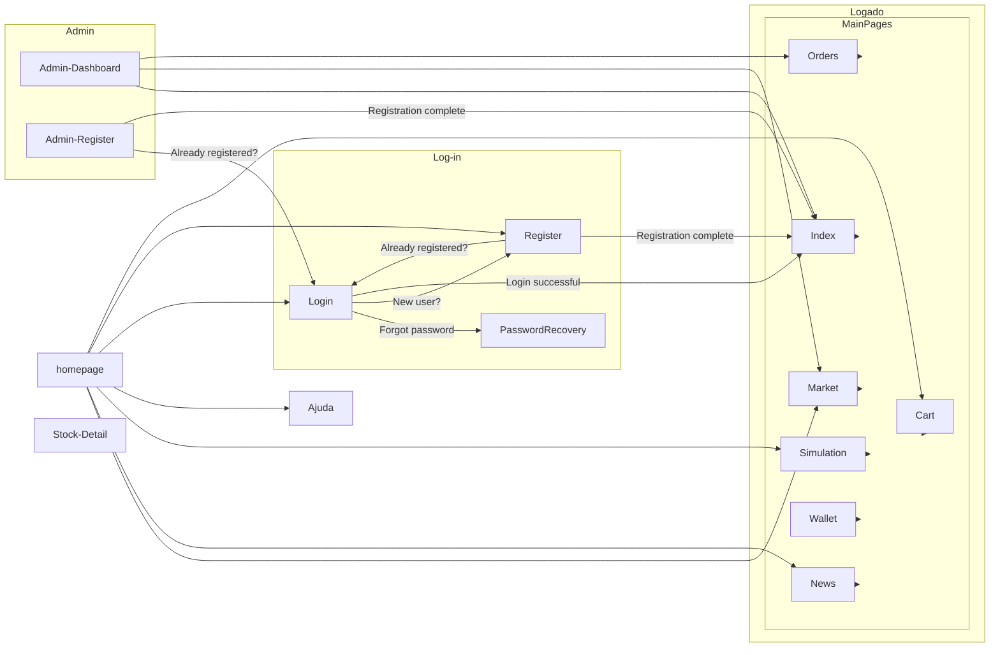

# Relatório do Projeto: LearnHub


**Universidade de São Paulo**  
**Instituto de Ciências Matemáticas e de Computação**

**Disciplina:** Introdução ao Desenvolvimento WEB  
**Abril de 2025**

**Grupo:**  
- Christyan Paniago Nantes - 15635906  
- Felipe Volkweis de Oliveira - 14570041  
- Vinicius Gustierrez Neves - 14749363  

---

## Índice
- [Requisitos](#requisitos)
- [Descrição do Projeto](#descrição-do-projeto)
- [Comentários sobre o Código](#comentários-sobre-o-código)
- [Plano de Testes](#plano-de-testes)
- [Resultados dos Testes](#resultados-dos-testes)
- [Procedimentos de Construção](#procedimentos-de-construção)
- [Problemas Encontrados](#problemas-encontrados)
- [Comentários Adicionais](#comentários-adicionais)

---

## Requisitos

### Requisitos Obrigatórios
- Dois tipos de usuários: Clientes e Administradores
- Funcionalidades CRUD para administradores
- Sistema de carrinho e pagamento

### Requisitos Específicos da Nossa Implementação
- Sistema de recomendação baseado em histórico de compras
- Integração com API de correios para cálculo de frete
- Chatbot para atendimento ao cliente

---

## Descrição do Projeto

### Arquitetura do Sistema


### Fluxo de Navegação
Talvez usar um fluxo assim? (tem q arrumar ta bugado, pq segui o atual e tem uns jump entre desautenticado e autenticado)


- Página inicial → Login → Dashboard personalizado
- Fluxo de compra: Seleção → Carrinho → Pagamento → Confirmação
- Painel admin: Gestão de usuários → Gestão de produtos → Relatórios

---

## Comentários sobre o Código

### Estrutura do Projeto
```
/src
|-- /client        # Front-end (React)
|-- /server        # Back-end (Node.js)
|-- /database      # Scripts MongoDB
|-- /tests         # Testes automatizados
```

### Decisões Técnicas
- Uso de Redux para gerenciamento de estado
- API RESTful com documentação Swagger
- Componentes reutilizáveis com Storybook

---

## Plano de Testes

### Testes Automatizados
- Testes de integração com Jest (90% de cobertura)
- Testes E2E com Cypress:
```javascript
describe('Fluxo de Compra', () => {
    it('Deve completar uma compra', () => {
        cy.addToCart()
        cy.checkout()
        cy.confirmPayment()
    })
})
```

### Testes Manuais
- Teste de usabilidade com 5 usuários reais
- Teste de carga com JMeter (1.000 usuários simultâneos)

---

## Resultados dos Testes

| Caso de Teste        | Resultado        | Problemas                      |
|----------------------|------------------|---------------------------------|
| Registro de usuário  | 100% sucesso      | -                               |
| Processo de compra   | 95% sucesso       | Falha no método de pagamento X  |
| Carga máxima         | 850 usuários      | Otimização necessária           |

---

## Procedimentos de Construção

### Pré-requisitos
```
- Node.js v18+
- MongoDB 6.0+
- Yarn
```

### Passo a Passo

1. Clonar o repositório:
    ```bash
    git clone https://github.com/nosso-projeto.git
    ```

2. Instalar as dependências:
    ```bash
    cd client && yarn install
    cd ../server && npm install
    ```

3. Iniciar os serviços:
    ```bash
    docker-compose up -d  # Banco de dados
    npm run dev           # Back-end
    yarn start            # Front-end
    ```

---

## Problemas Encontrados
- Incompatibilidade de versões entre React Router e Redux
- Problemas de concorrência no carrinho de compras
- Dificuldades na integração contínua com GitHub Actions

---

## Comentários Adicionais
- Sugerimos melhorar a documentação do Swagger
- A equipe pretende implementar PWA na próxima versão
- Reconhecemos a necessidade de melhorar os testes de segurança
