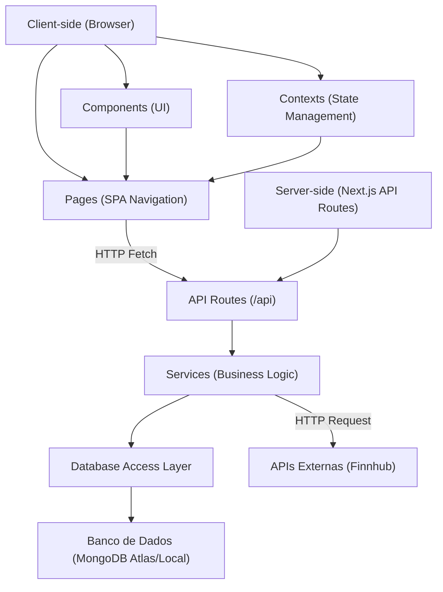
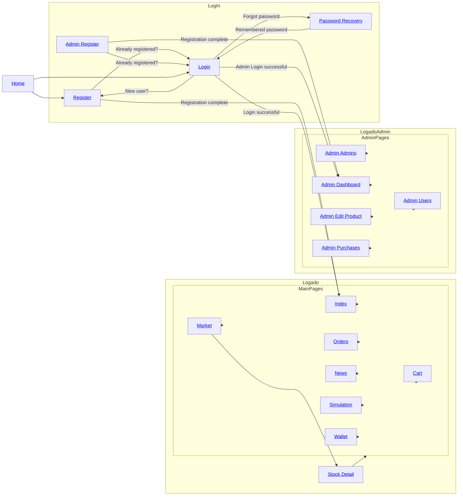
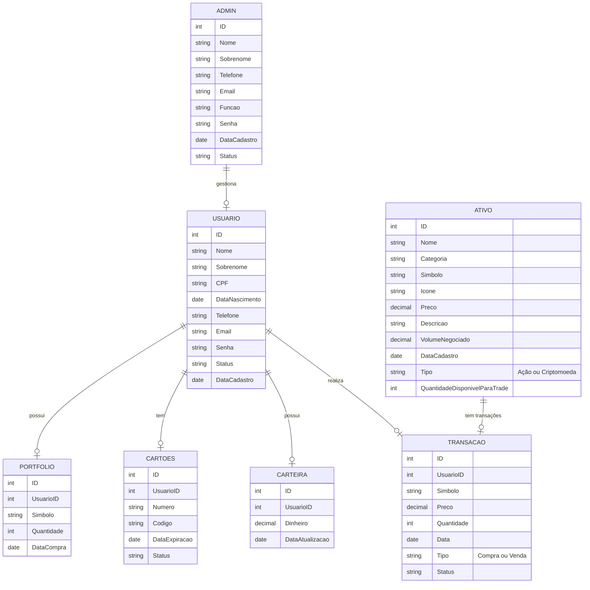

# Relatório do Projeto: OrangeWave - Milestone 3


**Universidade de São Paulo**  
**Instituto de Ciências Matemáticas e de Computação**

**Disciplina:** Introdução ao Desenvolvimento WEB  
**Maio de 2025**

**Grupo:**  
- Christyan Paniago Nantes - 15635906  
- Felipe Volkweis de Oliveira - 14570041  
- Vinicius Gustierrez Neves - 14749363  

---

## Índice
- [1. Requisitos](#requisitos)
- [2. Descrição do Projeto](#descrição-do-projeto)
- [3. Comentários sobre o Código](#comentários-sobre-o-código)
- [4. Plano de Testes](#plano-de-testes)
- [5. Resultados dos Testes](#resultados-dos-testes)
- [6. Procedimentos de Build](#procedimentos-de-build)
- [7. Problemas Encontrados](#problemas-encontrados)
- [8. Comentários Adicionais](#comentários-adicionais)

---

# Introdução - OrangeWave

**Plataforma de Simulação de Investimentos**  

Este projeto consiste em uma **corretora virtual de ações e criptomoedas**, desenvolvida como parte do trabalho final da disciplina. Diferente de um e-commerce tradicional, a plataforma simula operações de compra e venda de ativos financeiros em tempo real, utilizando APIs de mercado (como Finnhub) para dados autênticos, porém **sem transações reais**.  

**Objetivos Principais:**  
- Proporcionar uma experiência educativa sobre o mercado financeiro.  
- Cumprir os requisitos do curso (como CRUD de produtos e carrinho de compras) através de adaptações criativas:  
  - *Produtos* → Ações/criptomoedas.  
  - *Carrinho* → Ordens de trade pendentes.  
  - *Pagamento* → Confirmação com cartão fictício.  
- Oferecer funcionalidades exclusivas, como **simulador de estratégias** e **visualização de notícias relevantes aos Trades**.  

**Público-Alvo:**  
- Estudantes de finanças.  
- Iniciantes no mercado de investimentos.  

**Tecnologias-Chave:**  
- Vite
- TypeScript
- React
- Tailwind CSS
- Dados em tempo real: APIs Finnhub.  

## Requisitos

### 1.1 Requisitos Funcionais
**Tipos de Usuários:**  
- **Clientes (Investidores):**  
  - Cadastrar-se e fazer login.  
  - Visualizar dados de ações/criptomoedas em tempo real (via API Finnhub).  
  - Simular ordens de compra/venda com valor da carteira ou com cartão de crétido fictício.  
  - Acessar portfólio e histórico de transações.
  - Adcionar e remover dinheiro da carteira.
  - Acompanhar notícias do mercado financeiro.
- **Administradores:**  
  - Gerenciar ativos listados (adicionar/editar/remover ações/criptomoedas).  
  - Adicionar e remover outros administradores e clientes.
  - Visualizar dados dos usuários e transações na plataforma.
  - Exportar dados para arquivos CSV.  

**Funcionalidades Principais:**  
- **Listagem de Ativos:**  
  - Exibir ativos (nome, símbolo, logo, preço atual, variação 24h).  
  - Filtros por tipo (ações/cripto), volatilidade ou setor na aba de mercado.  
- **Simulação de Trading:**  
  - Interface de "Comprar/Vender" com seletor de quantidade (substitui o "carrinho").  
  - Operações de compras e venda de ativos simulado em tempo real, de forma a permitir a avaliaççao de habilidades de trading de ativos.
  - Saldo fictício e persistência de posição ao longo da simulação. 
- **Acompanhamento de Portfólio:**  
  - Mostrar saldo virtual da carteira, ativos adquiridos e lucro/prejuízo em cada um.  
- **Painel do Administrador:**  
  - CRUD de ativos e de usuários da plataforma.
- **Carrinho:**
  - Compra de ativos utilizando saldo da plataforma ou cartão de crédito.
  - Limitação do valor de compras com saldo da conta.
  - Limitação da quantidade a ser comprada baseando-se no estoque do produto.
- **Ativos e carteira da plataforma:**
  - Venda de ativos possuídos, com acrescimento do valor de venda no saldo da plataforma.
  - Possibilidade de depósito e saque do valor da conta.
- **Controle de histórico:**
  - Histórico de saques e depósitos.
  - Histórico de compra e venda de ativos.
- **Controle de estoque:**
  - Cada ativo possui um estoque, que é decrescido ao realizar compras e acrescido quando o usuário realiza vendas de ativos comprados.
  - O site bloqueia compras quando o produto está fora de estoque.

#### 1.2 Requisitos Não-Funcionais 
- **Usabilidade:**  
  - Design responsivo (mobile/desktop).  
  - Navegação intuitiva.  
- **Acessibilidade:**  
  - Contraste adequado e labels para leitores de tela.  
- **Segurança:**  
  - Autenticação básica com e-mail e senha.  

#### 1.3 Adaptações 
- **Funcionalidade Extra:**  
  - Simulador de estratégias/trading com dados históricos (diferencial).  
  - Display de notícias relevantes para Trading (diferencial).
  - Exportação de dados CSV da plataforma pelo ADMIN (ativos e transações).

---

## Descrição do Projeto
### **Projeto: OrangeWave**  

Este projeto consiste em uma **corretora virtual de ações e criptomoedas**, desenvolvida como trabalho final de disciplina. A plataforma permite que usuários simulem operações de compra e venda de ativos financeiros utilizando dados em tempo real de APIs como **Finnhub**, sem envolver transações reais.  

---

# Estrutura de Páginas (.tsx)

A seguir estão as páginas do projeto organizadas por áreas, com todos os arquivos convertidos para `.tsx` e nomeados com letras maiúsculas no estilo PascalCase.

### Área do Cliente 
- **Index** (`Index.tsx`): Página inicial
- **Dashboard** (`Dashboard.tsx`): Página inicial após o login para visualização de ativos possuidos, variação de preço e distribuição da carteira.
- **Mercado** (`Market.tsx`): Visualização de ações e criptomoedas com filtros.  
- **Detalhes do Ativo** (`StockDetail.tsx`): Gráficos de preço, histórico e opção de compra/venda.  
- **Carteira** (`Wallet.tsx`): Saldo virtual e portfólio de investimentos.  
- **Carrinho** (`Cart.tsx`): Confirmação de ordens com cartão fictício.  
- **Notícias** (`News.tsx`): Feed de notícias financeiras (integrado à API).  
- **Histórico** (`Orders.tsx`): Registro de transações simuladas.  
- **Simulador de Estratégias** (`Simulation.tsx`): Teste de estratégias com dados históricos.  

### Área do Administrador 
- **Dashboard** (`Dashboard.tsx`): Visão geral de usuários e movimentações.  
- **Cadastro de Ativos** (`Carts.tsx`): Visualização de carrinhos abertos
- **Cadastro de Novos Admins** (`Stocks.tsx`): CRUD de ações/criptomoedas  
- **Gerenciamento de Admins** (`Transactions.tsx`):  Visualizar compras de ações/criptomoedas dos usuários.   
- **Gerenciamento de Usuários** (`Users.tsx`): Visualização e controle de usuários e administradores registrados.  

### Funcionalidades Compartilhadas 
- **Homepage** (`Home.tsx`): Homepage da aplicação  
- **Autenticação** (`Login.tsx`, `Register.tsx`): Fluxo completo de login e cadastro.  


---

### Arquitetura do Sistema

### Fluxo de Navegação


---

### Diagrama de Entidade Relacionamento

## 3. Comentários sobre o Código

A aplicação continua priorizando **modularidade** e **reutilização** de componentes React, com **Context&nbsp;API** cuidando do estado global (autenticação, carteira, ordens e portfólio).  
A principal mudança nesta *release* final é que **toda a camada de persistência foi migrada para um banco de dados MongoDB hospedado no [MongoDB Atlas](https://www.mongodb.com/cloud/atlas)**.  
Qualquer dado transacional ou cadastral exibido pela interface agora é lido diretamente do cluster Atlas via API própria do projeto.

**Observação:** as cotações de ativos são extraídas diretamente do banco de dados, mas permanecem estáticas pois, para o trabalho atual, não há integração direta com uma API para extrair esses dados em tempo real. Entretando, isso poderia ser um aspecto para melhoria futura na plataforma, tornando-a 100% funcional para usuários reais que queiram acompanhar o mercado financeiro e simular operações em bolsa. Tudo que envolva preços ou gráficos é considerado **funcionalidade extra** e **não** entra nos critérios de avaliação.

---

### Estrutura e Organização

- **React + TypeScript** em componentes funcionais  
- **Context API** coordena estados voláteis da sessão  
- Requisições concentradas em `services/`, apontando para o **servidor Node/Express local** que faz a ponte com o Atlas  
- Estilização com **Tailwind CSS**  

- Exige a variável `MONGODB_URI` no arquivo `.env`  
- Scripts de build/start garantem que o **servidor Express** inicialize antes do front-end  
- *Seeders* do cluster em `scripts/seed/`

---

## 4. Plano de Testes (Manual)

Abaixo estão listadas as principais funcionalidades testadas, com foco tanto nas ações do usuário comum quanto nas funcionalidades administrativas.

### Funcionalidades a serem testadas (Usuário):
- **Adição de ativos ao carrinho com limite de estoque**  
  - Esperado: impedir adição acima da quantidade disponível.
- **Ajuste de quantidade no carrinho (aumento, diminuição, exclusão)**  
  - Esperado: atualização automática do valor total e quantidade selecionada.
- **Compra com saldo da carteira**  
  - Esperado: falha caso o valor total ultrapasse o saldo ou o estoque; sucesso se dentro dos limites. Estoque, histórico, saldo da conta e posição são atualizados.
- **Compra com cartão de crédito (sem limite de saldo)**  
  - Esperado: transação permitida se houver estoque; atualiza histórico, estoque, saldo da conta e posição.
- **Venda de ativos adquiridos**  
  - Esperado: acréscimo ao saldo virtual, redução proporcional no portfólio, atualização do histórico e aumento do estoque.
- **Inserção e remoção de valores na carteira**  
  - Esperado: saldo atualizado em tempo real; impedir retirada acima do saldo.
- **Exibição de notícias do mercado**  
  - Esperado: carregar feed com títulos e notícias.
- **Teste de simulação de trading**
  - Esperado: Permitir compras, vendas, configuração de saldo inicial, visualização da posição atual e variação do valor ao longo da simulação.

### Funcionalidades a serem testadas (Administrador):
- **CRUD de Ativos (ações e criptomoedas)**  
  - Esperado: inclusão, edição e exclusão corretas; refletidas imediatamente nas telas do administrador
- **CRUD de Usuários e Administradores**  
  - Esperado: visualizar usuários, cadastrar e excluir contas com efeito imediato nos dados simulados.
- **Visualização de movimentações e exportações**  
  - Esperado: painel de transações, filtro por tipo e exportação em formato CSV funcionando corretamente.
- **Validação de acesso restrito a administradores**  
  - Esperado: bloqueio de rotas exclusivas quando logado como cliente comum ou não autenticado.

**Observação:** Para a entrega final, consideramos que, ao criar um novo ativo, ainda não tenha nenhum dado registrado para ele e, portanto, ele nao conterá nenhuma informação de histórico de preços. O mesmo princípio ocorre para o histórico do partifólio do usuário. Dessa forma, esses testes devem ser desconsiderados por se tratarem de funcionalidades extras.
---

## Resultados dos Testes (Manual)

| Cenário de Teste | Resultado Esperado | Exemplo |
|------------------|--------------------|---------|
| Adição acima do estoque | Bloqueia ação e exibe alerta | Estoque: 200, tentativa: 250 → ⚠️ erro |
| Diminuição de quantidade | Subtotal e estoque ajustados corretamente | De 160 para 40, estoque volta a 160 |
| Compra com saldo suficiente | Transação bem-sucedida, histórico atualizado | Saldo: R$1000, compra: R$414 → saldo: R$586 |
| Compra com saldo insuficiente | Bloqueia compra com alerta | Saldo: R$200, compra: R$414 → ⚠️ erro |
| Compra com cartão (estoque disponível) | Compra autorizada, estoque ajustado | Cartão → compra de 3 ativos (estoque 5) → OK |
| Venda de ativos | Carteira atualizada, ativo removido do portfólio | Venda de 2 ações → +R$828, -2 ativos |
| Inserção de saldo | Saldo incrementado instantaneamente | +R$500 → saldo atualizado |
| Remoção de saldo | Redução até limite zero permitida | -R$200 → saldo atualizado |
| Edição de ativo existente (admin) | Mudanças refletidas em tempo real | Alterar preço de "Apple" → atualizado na aba do admin|
| Exclusão de ativo (admin) | Remoção imediata da listagem | "Bitcoin" excluído → removido do painel do admin|
| Exportação de transações | CSV gerado corretamente | 10 transações → CSV baixado com colunas válidas |

---

### Testes de Requisições (Postman)

Coleção com todos os endpoints REST (CRUD de usuários, carteira, ordens, histórico...) para serem testados. Grande parte das requisições exige um token de identificação do usuário. Dessa forma, crie um usuário pela requisição em /register mudando o JSON, faça login com a requisição em /login com os dados cadastrados no primeiro passo, copie o token retornado no login. AO entrar na requisição desejada no postman, vá em "Authorization", selecione a opção de "Barear Token" e cole o seu tokem gerado pelo login. Você já, pode mandar requisições para aquela rota. O mesmo deve se repetir para outras requisições, sendo que algumas exigem um token de admnitrador, repetindo o mesmo processo dos passos 1 e 2 para um usuario determinado como "admin"

[**Coleção Postman – API Corretora**](https://viniciusgustierrezneves.postman.co/workspace/My-Workspace~9f0a4b32-7fd1-414a-883f-f45966fff052/collection/45242465-73e693e6-f685-46de-94ff-48b9ab25abe5?action=share&creator=45242465) <!-- substitua pelo link público -->

**Siga os procedimentos detalhados na parte de procedimentos de Build para rodar o servido e, então, começe a fazer requisições no Postman se preferir.**

---

## 4.1 Testes Automatizados (Jest + TypeScript)

Além do **plano de testes manuais** descrito acima, entregamos uma suíte básica
de **regressão automática** para os endpoints mais críticos da API
(usuários, ativos, preços e notícias).  
Os testes foram escritos com **Jest 29**, **Supertest** e **ts-jest**, focando
nos cenários de _happy-path_ e em bordas que poderiam corromper o estado do
banco.

### ➊ Instalação das dependências de teste

> As dependências abaixo são **apenas de desenvolvimento** (não afetam o build
> de produção).

```bash
# dentro de /server
npm i -D jest ts-jest @types/jest supertest @types/supertest

# ainda em /server
npm run test            # atalho para “jest --runInBand”
```
| Script              | Descrição                                                                                 |
|---------------------|-------------------------------------------------------------------------------------------|
| `npm run test`      | Executa **todas** as suítes Jest uma única vez (`--runInBand`).                            |

---

### ➌ O que está coberto?

| Arquivo da suíte                         | Foco principal                                                                         |
|------------------------------------------|----------------------------------------------------------------------------------------|
| `src/tests/userController.test.ts`       | Endpoints **/api/users** – autenticação, CRUD de perfil, reset de senha                |
| `src/tests/assetController.test.ts`      | Endpoints **/api/assets** – listar, criar, atualizar e deletar ativos                  |
| `src/tests/priceController.test.ts`      | Endpoints **/api/prices** – filtros de *timeframe* e último snapshot por ativo         |
| `src/tests/newsController.test.ts`       | Endpoints **/api/news** – CRUD completo com validação de `category`                    |

Fluxo executado em **cada** suíte:

1. Conecta-se ao **`MONGODB_URI`** definido no `.env`;
2. Insere **documentos de teste** (não altera dados reais);
3. Executa as chamadas HTTP usando **Supertest**;
4. Limpa os documentos criados e encerra a conexão.

---

### ➍ Saída esperada

```text
✅ MongoDB conectado
 PASS  src/tests/userController.test.ts   (3.4 s)
 PASS  src/tests/assetController.test.ts  (2.1 s)
 PASS  src/tests/priceController.test.ts  (1.8 s)
 PASS  src/tests/newsController.test.ts   (2.0 s)

Test Suites: 4 passed, 4 total
Tests:       23 passed, 23 total
```

### ➎ Por que testamos **apenas esse subconjunto?**

A aplicação **já** oferece:

- Um **roteiro manual** detalhado (ver seção *Plano de Testes*);  
- Uma **coleção Postman pública** que cobre fluxos extensos (carteira, ordens, etc.).

Automatizar **todos** os cenários seria redundante neste momento.  
Selecionamos os testes que:

- **Modificam coleções sensíveis** &nbsp;(`users`, `assets`, `prices`, `news`);
- Exercitam o **middleware** de autenticação  
  (`verifyToken`, `isAdmin`).

A infraestrutura de testes  
(`connectDB` / `disconnectDB` + **Supertest(app)**) já está pronta para que você amplie a cobertura quando necessário.


---

## 6. Procedimentos de Build:

O único requisito é ter o Node.js e o npm instalados - [instalar com nvm](https://github.com/nvm-sh/nvm#installing-and-updating)

Siga os seguintes passos:

`
**Passo-a-passo:**

```bash
# 1. clone o repositório
git clone https://github.com/Vinicius-GN/OrangeWave
cd OrangeWave

# 2. instale dependências do projeto
npm install

# 3. instale dependências do servidor
cd server
npm install

# 4. inicie servidor (em /server)
npm run start
#Deve aparecer a mensagem no terminal:"
#✅ MongoDB conectado
#🚀 Server em http://localhost:3001"

# 5. inicie o front-end da aplicação (em /OrangeWave)
cd ..
npm run dev

```
**Agora, o tanto o site quanto o servidor devem estar rodando tranquilamente e prontos para serem testados. Caso haja qualquer problema, favor entrar em contato pelo e-mail viniciusgustierrez@usp.br** 

### 7. Login:

Para realizar o login na plataforma
- Faça login na plataforma com o usuário "grupo@gmail.com" e "senha123" para acessar as funcionalidades de cliente
- Faça login na plataforma com o usuário "admin@gmail.com" e "senha123" para acessar as funcionalidades de administrador
- Crie seu próprio usuário na plataforma para testar as funcionalidades da maneira que preferir

## 8. Problemas Encontrados:
Sem problemas encontradoos

## Comentários Adicionais
Colaborações são bem-vindas! Abra um Issue no repositório para que fiquemos cientes dos problemas da plataforma e continuemos a aprimorar o projeto.
