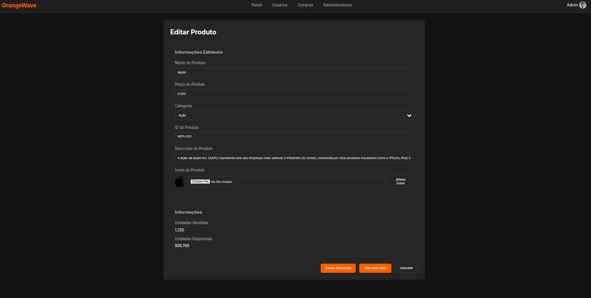
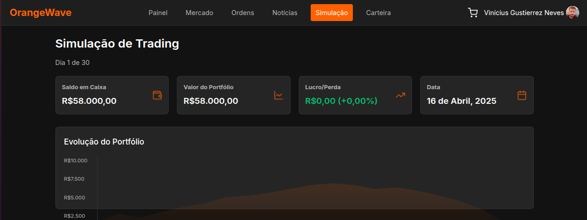
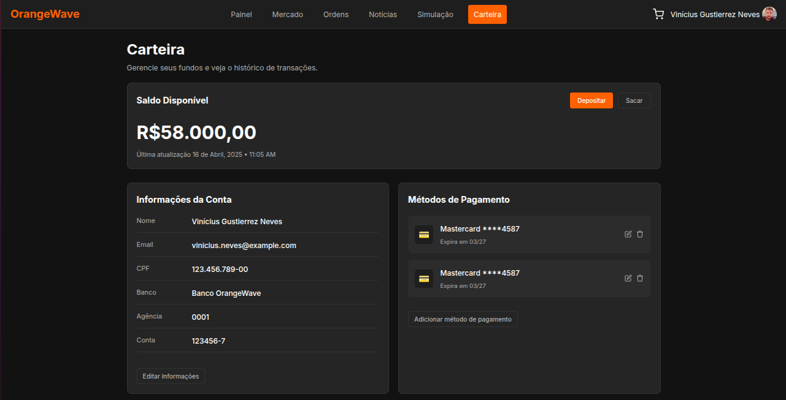

# Relatório do Projeto: OrangeWave


**Universidade de São Paulo**  
**Instituto de Ciências Matemáticas e de Computação**

**Disciplina:** Introdução ao Desenvolvimento WEB  
**Abril de 2025**

**Grupo:**  
- Christyan Paniago Nantes - 15635906  
- Felipe Volkweis de Oliveira - 14570041  
- Vinicius Gustierrez Neves - 14749363  

---

## Índice
- [1. Requisitos](#requisitos)
- [2. Descrição do Projeto](#descrição-do-projeto)
- [3. Comentários sobre o Código](#comentários-sobre-o-código)
- [4. Plano de Testes](#plano-de-testes)
- [5. Resultados dos Testes](#resultados-dos-testes)
- [6. Procedimentos de Build](#procedimentos-de-construção)
- [7. Problemas Encontrados](#problemas-encontrados)
- [8. Comentários Adicionais](#comentários-adicionais)

---

# Introdução - OrangeWave

**Plataforma de Simulação de Investimentos**  

Este projeto consiste em uma **corretora virtual de ações e criptomoedas**, desenvolvida como parte do trabalho final da disciplina. Diferente de um e-commerce tradicional, a plataforma simula operações de compra e venda de ativos financeiros em tempo real, utilizando APIs de mercado (como Finnhub) para dados autênticos, porém **sem transações reais**.  

**Objetivos Principais:**  
- Proporcionar uma experiência educativa sobre o mercado financeiro.  
- Cumprir os requisitos do curso (como CRUD de produtos e carrinho de compras) através de adaptações criativas:  
  - *Produtos* → Ações/criptomoedas.  
  - *Carrinho* → Ordens de trade pendentes.  
  - *Pagamento* → Confirmação com cartão fictício.  
- Oferecer funcionalidades exclusivas, como **simulador de estratégias** e **visualização de notícias relevantes aos Trades**.  

**Público-Alvo:**  
- Estudantes de finanças.  
- Iniciantes no mercado de investimentos.  

**Tecnologias-Chave:**  
- Frontend: HTML5, CSS3, JavaScript (SPA).  
- Dados em tempo real: APIs Finnhub.  

## Requisitos

### 1.1 Requisitos Funcionais
**Tipos de Usuários:**  
- **Clientes (Investidores):**  
  - Cadastrar-se e fazer login.  
  - Visualizar dados de ações/criptomoedas em tempo real (via API Finnhub).  
  - Simular ordens de compra/venda (sem uso de dinheiro real).  
  - Acessar portfólio e histórico de transações.  
- **Administradores:**  
  - Gerenciar ativos listados (adicionar/editar ações/criptomoedas).  
  - Aprovar/rejeitar ordens grandes (simulado).  
  - Visualizar logs de atividade dos usuários.  

**Funcionalidades Principais:**  
- **Listagem de Ativos:**  
  - Exibir ativos (nome, símbolo, logo, preço atual, variação 24h).  
  - Filtros por tipo (ações/cripto), volatilidade ou setor.  
- **Simulação de Trading:**  
  - Interface de "Comprar/Vender" com seletor de quantidade (substitui o "carrinho").  
  - Confirmação de pagamento simulado (solicitar número de cartão fictício).  
- **Acompanhamento de Portfólio:**  
  - Mostrar saldo virtual, ativos adquiridos e lucro/prejuízo.  
- **Painel do Administrador:**  
  - CRUD de ativos (ex: adicionar ação com `símbolo`, `nome`, `setor`, `preço_inicial`).  

#### 1.2 Requisitos Não-Funcionais 
- **Desempenho:**  
  - Dados da API atualizados a cada 30 segundos (simular tempo real).  
- **Usabilidade:**  
  - Design responsivo (mobile/desktop).  
  - Navegação intuitiva em SPA (sem recarregar a página).  
- **Acessibilidade:**  
  - Contraste adequado e labels para leitores de tela.  
- **Segurança:**  
  - Autenticação básica.  

#### 1.3 Adaptações
- **Substituições de Termos:**  
  - "Carrinho" → "Ordem Pendente".  
  - "Estoque" → "Disponibilidade para Trade".  
- **Funcionalidade Extra:**  
  - Simulador de estratégias com dados históricos (diferencial).  
  - Display de notícias relevantes para Trading

---

### Justificativa das Adaptações  
O projeto de corretora de ações não se encaixa perfeitamente nos requisitos de e-commerce tradicional, mas as adaptações mantêm a essência solicitada:  
- **Pagamento com cartão:** Incluído como campo fictício na confirmação de ordens.  
- **"Quantidade vendida":** Interpretada como volume negociado (puxado da API).  
- **Área administrativa:** Garante o CRUD de produtos (ativos), conforme exigido.  

---

## Descrição do Projeto
### **Projeto: OrangeWave**  

Este projeto consiste em uma **corretora virtual de ações e criptomoedas**, desenvolvida como trabalho final de disciplina. A plataforma permite que usuários simulem operações de compra e venda de ativos financeiros utilizando dados em tempo real de APIs como **Finnhub**, sem envolver transações reais.  

**Tecnologias:** HTML5, CSS3, JavaScript (SPA), APIs Financeiras  

---

### Funcionalidades

### Área do Cliente 
- **Mercado** (`market.html`): Visualização de ações e criptomoedas com filtros.  
- **Detalhes do Ativo** (`stock-detail.html`): Gráficos de preço, histórico e opção de compra/venda.  
- **Carteira** (`wallet.html`): Saldo virtual e portfólio de investimentos.  
- **Carrinho** (`cart.html`): Confirmação de ordens com cartão fictício.  
- **Notícias** (`news.html`): Feed de notícias financeiras (integrado à API).  
- **Histórico** (`orders.html`): Registro de transações simuladas.  
- **Simulador de Estratégias** (`simulation.html`): Teste de estratégias com dados históricos.  

### Área do Administrador 
- **Dashboard** (`admin-dashboard.html`): Visão geral de usuários e movimentações.  
- **Cadastro de Ativos** (`admin-edit-product.html`): CRUD de ações/criptomoedas.  
- **Cadastro de Novos Admins** (`admin-register.html`): Criação de novos administradores.  
- **Ver Histórico de Compras** (`admin-purchases.html`): Visualizar compras de ações/criptomoedas dos usuários.  
- **Gerenciamento de Admins** (`admin-admins.html`): Lista e gerenciamento de administradores.  
- **Gerenciamento de Usuários** (`admin-users.html`): Visualização e controle de usuários registrados.  

### Funcionalidades Compartilhadas 
- **Autenticação** (`login.html`, `register.html`, `password-recovery.html`): Fluxo completo de login e cadastro.

---

### Estrutura de Arquivos

```
├── img-previews   # Páginas para exibição no Readme
└── src            # Arquivos source do projeto
    ├── pages      # Páginas HTML
    └── styles     # Arquivos de CSS
```

### Arquitetura do Sistema

### Fluxo de Navegação
Talvez usar um fluxo assim? (tem q arrumar ta bugado, pq segui o atual e tem uns jump entre desautenticado e autenticado)


- Página inicial → Login → Dashboard personalizado
- Fluxo de compra: Seleção → Carrinho → Pagamento → Confirmação
- Painel admin: Gestão de usuários → Gestão de produtos → Relatórios

### Mockups das Páginas


#### Página: Admin - Admins (`admin-admins.html`)


---

#### Página: Admin - Dashboard (`admin-dashboard.html`)


---

#### Página: Admin - Editar Produto (`admin-edit-product.html`)


---

#### Página: Admin - Compras (`admin-purchases.html`)


---

#### Página: Admin - Cadastro de Produto (`admin-register.html`)


---

#### Página: Admin - Usuários (`admin-users.html`)


---

#### Página: Carrinho (`cart.html`)


---

#### Página: Home (`home.html`)


---

#### Página: Index (`index.html`)


---

#### Página: Login (`login.html`)


---

#### Página: Mercado (`market.html`)


---

#### Página: Notícias (`news.html`)


---

#### Página: Histórico de Ordens (`orders.html`)


---

#### Página: Recuperação de Senha (`password-recovery.html`)


---

#### Página: Registro (`register.html`)


---

#### Página: Simulação de Estratégias (`simulation.html`)


---

#### Página: Detalhes do Ativo (`stock-detail.html`)


---

#### Página: Carteira (`wallet.html`)


---

## Comentários sobre o Código
- TBD

## Plano de Testes
- TBD

## Resultados dos Testes
- TBD

## Procedimentos de Build
- TBD

## Problemas Encontrados
- TBD

## Comentários Adicionais
- TBD
